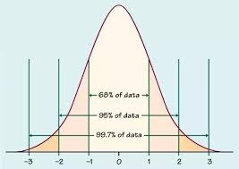
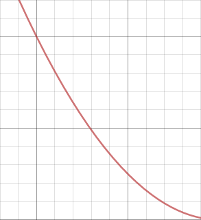
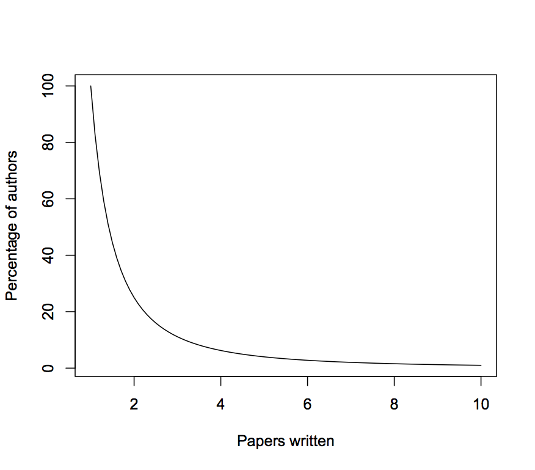
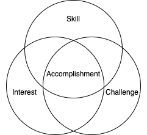

Introduction
------------

There are reasons to read this book and _not_ to read this book.

First, the not-reason. From the title, _Human Accomplishment_ details the successes of humans from 800 BCE to 1950—2750 years of achievement by the top-tier of _homo sapiens_. Statistically speaking, the average person will neither contribute nor perform anything absolutely significant to society. (They may contribute some relatively significant, but nothing absolute.) This book serves as a stark reminder of this fact. Some are uncomfortable with this and prefer to live thinking that they have or eventually will have a profound impact on the world, which is perfectly fine. Don't read this book nor this review. Done.

Now, the more compelling to-reason from another perspective. From the title, _Human Accomplishment_ details the successes of humans from 800 BCE to 1950—2750 years of achievement by the top-tier of _homo sapiens_. Conveniently compiled in a single 668-page book (which includes the main body chapter, appendices, notes, bibliography, and index), Murray objectively (more on the use of this term later) lays out the crowning moments of the human race in science and the arts. No need to go through volumes of text wondering if your favorite author is considered among the best ever (hint: they're probably not). Instead, consult this book and find out who the best ever are among sciences, philosophy, art, technology, and literature.

Do not let Murray's reputation from his book [_The Bell Curve_](https://en.wikipedia.org/wiki/The_Bell_Curve) dissuade you from reading this book. While there are some topics that will no doubt draw criticisms from some readers (e.g., the lack of women among the significant figures), Murray defends his position both qualitatively and quantitatively and invites the reader to challenge him with a rebuttal of their own.

* * *

Objectivity and Defining Excellence
-----------------------------------

How is one to define excellence, when it is by definition subjective? One person may consider a [Jackson Pollock painting](https://www.google.com/search?q=jackson+pollock&sxsrf=ALeKk02nECMeRPnfGnSg0hcc66Hu6eQKOQ:1586396271677&source=lnms&tbm=isch&sa=X&ved=2ahUKEwjk8vvRmtroAhXNna0KHRo5AdYQ_AUoAXoECCQQAw&biw=1600&bih=714) to be excellent, while another may deem it pointless and ugly. So, who's to say what's excellent and what's not?

Murray gives two separate definitions for excellence: one for science and one for the arts. (Murray separates analyses for science and art throughout the book, as they should be viewed separately.)

### Excellence in Science

Murray's first indicator of excellence is _truth_, defined by William James ([Stanford Encyclopedia of Philosophy](https://plato.stanford.edu/entries/james/), [Wikipedia](https://en.wikipedia.org/wiki/William_James)) as "true ideas are those that we can assimilate, validate, corroborate, and verify." This idea of validation and verification is one of the tenets of science.

Another question Murray asks is "Does Importance Equal Excellence in Scientific Accomplishment?" Generally, yes—and Murray agrees. Exceptions include accidental discoveries or inventions, such as [Alexander Fleming's discovery of Penicillium chrysogenum](https://www.acs.org/content/acs/en/education/whatischemistry/landmarks/flemingpenicillin.html), which is used to create [penicillin](https://en.wikipedia.org/wiki/Penicillin). After leaving out petri dishes over a number of days, he noticed a single sample was behaving oddly: one part did not have the bacteria growth he expected. It was here that a strain of Penicillium chrysogenum was found, previously unknown to scientists. Fleming published these results without knowing the importance, and left it up to other scientists to further the research. While this discovery was incredibly important, providing us with a powerful new antibiotic, the excellence is not there. No fancy or novel scientific method was performed, nor did Fleming even attempt to find anything remotely close to this. The entire discovery was pure accident.

Fleming's famous petri dish

### Excellence in the Arts

Murray uses David Hume ([Stanford Encyclopedia of Philosophy](https://plato.stanford.edu/entries/hume/), [Wikipedia](https://en.wikipedia.org/wiki/David_Hume)) to prove his point, providing two different types of taste: sentiment and judgment.

Sentiment is synonymous with what most consider an average "opinion": it can't be right or wrong, it just is. Everyone is entitled to one, no matter their knowledge or experience.

Judgement can be right or wrong and is based on objective truth, despite what some may reject. A few details must be presented to back up this claim.

First, there are events and things in nature that are aesthetic for unknown reasons. Take the [golden ratio](https://en.wikipedia.org/wiki/Golden_ratio), a seemingly arbitrary number equal to 1.618 and defined by:

\\\[\\frac{a+b}{a} = \\frac{a}{b} = \\varphi\\\]

This ratio is found everywhere: [architecture](https://en.wikipedia.org/wiki/List_of_works_designed_with_the_golden_ratio#Ancient_and_medieval_architecture) ([interesting paper](https://www.sciencedirect.com/science/article/pii/S1110016815000265) discussing why the ratio is often used in design), [art](https://news.artnet.com/art-world/golden-ratio-in-art-328435), and [nature](https://science.howstuffworks.com/math-concepts/fibonacci-nature1.htm).

Line showing the golden ratio

This proportion is arguably _objectively_ aesthetic, allowing judgment to mark works that use it as better than those that don't. (Of course, other factors come into play. Simply drawing the above picture does not make it better than a [Bob Ross painting](https://www.twoinchbrush.com/all-paintings) that didn't use the ratio.) As to understanding our tendency to use and enjoy this number, one professor claims that it is "[part of an an evolutionary phenomenon that facilitates the flow of information](https://www.witpress.com/elibrary/dne-volumes/4/2/403)."

Second, expertise is proportional to knowledge and appreciation ability. Two examples and an exercise can be used to prove this point:

*   **Freeride mountain biking**. [Riders go off massive jumps and drops, all while doing technical tricks](https://youtu.be/iUeZMGrLAhY?t=55). The average viewer watches and oohs and ahhs at the riders, but only someone who has ridden a bike AND tried to do basic tricks will be able to understand and appreciate the difficulty of what they're doing.

Backflip tuck no-hander

*   **Artwork**. Looking at paintings is fun, but it takes someone who has painted and understands the practice to be able to recognize the methods the artist employed in their artwork. [_Leonardo da Vinci_](https://www.goodreads.com/book/show/34684622-leonardo-da-vinci?ac=1&from_search=true&qid=9ay8BRN8zo&rank=1) by Walter Isaacson does an excellent job of analyzing most of Leonardo's works, explaining the techniques and thought process in laymen terms.

*   **Exercise**. Think of something you (the reader) are considered good or an expert at, then think of the last time a novice or unexperienced person critiqued it. Were their points valid? Did they consider everything you considered? Likely not.

This ability for experts to judge art allows for measurements to take place, and is seen by the consistent judgment of so-called "classic" pieces of artwork.

* * *

Inventories and Index Scores
----------------------------

Murray defines the term inventory as the collection of people and vents comprising a specific field, such as Western philosophy. Inventories were made for twelve fields, each with separate subfields (the first number in parentheses is number of sources consulted in creating the inventory and the second number is total number of significant figures for the inventory):

*   Literature: Arabia (15 sources, 82 significant figures), China (15, 83), India (12, 43), Japan (12, 85), the West (20, 835)
*   Visual arts (sculpture and painting): China (20, 111), Japan (16, 81), the West (13, 479)
*   Music: the West (since 1200) (17, 522)
*   Astronomy (22, 124)
*   Biology (22, 193)
*   Chemistry (22, 204)
*   Earth sciences (22, 85)
*   Physics (22, 218)
*   Mathematics (28, 191)
*   Medicine (20, 160)
*   Technology (19, 239)
*   Philosophy: China (13, 39), India (13, 45), the West (14, 155)

You may ask why Africa, South America, or Oceania were not included in any of the twelve inventories or their subfields, or why China, etc. weren't included as separate subfields? To be frank, they don't have achievements worth listing in the inventories during the time period Murray is examining. For example, [African philosophy lacked written documentation up to the 1920s](https://www.iep.utm.edu/afric-hi/#H1), and even then, its [content up to 1950 focused on "retrieving and reconstructing African identity"](https://www.iep.utm.edu/afric-hi/#SH6a), rather than contributing to philosophy as an entire field of study.

It is during this chapter that Murray introduces two of the book's most important terms: _significant figures_ and _index scores_.

### Significant Figures

The inventories are made up of multiple different sources (see specific numbers in the inventory lists previously mentioned), each with its own set of individuals it deems important. For example, Porter's _The Cambridge Illustrated History of Medicine_ may consider one doctor to be important and mention him, while Magner's _A History of Medicine_ agrees somewhat, but doesn't have enough room since the book is already pushing 1000 pages, so sorry doctor, you're left out.

So, how to determine if someone is significant? Murray, while conceding it as an arbitrary percentage, defines significant as "anyone who is mentioned in at least 50 percent of the qualified sources for a given inventory with a _qualified source_ being one that meets certain criteria of comprehensiveness in covering the topic in question." The qualified source qualifier is important, as it gives one country's figure a fair chance at being considered significant if the source is written by someone not from there (and is likely to be a bit more focused on, knowledgable about, and partial to his own countrymen).

### Index Scores

An index score is a simple way to determine a person's amount of significance. Two important notes about index scores:

1.  Index scores cannot be compared across inventories. One individual having an index score of 100 in one inventory does not mean they are more significant than someone having an index score of 75 in another inventory.
2.  Index scores measure the significance relative to others within the same field, and field size varies dramatically (compare 43 Indian literature figures to 835 Western literature figures).

Murray first calculated the raw score of all individuals, where the raw score is the percentage of "attention distributed among all the significant figures" in that inventory. The raw score was then (linearly) transformed into a common scale of 1-100.

Now, how to tell if these scores are reliable? After all, the sources could be flawed and give undue credit to certain figures, skewing the scores. Murray recognizes this and offers two checks on his method:

*   **Face validity**. Does it make sense that those figures are there? This obviously works on the more prominent figures, like Aristotle (index score of 100 in Western philosophy and 94 in biology) and Newton (index score of 100 in physics and 89 in mathematics). One issue arises when the reader (and Murray) are unfamiliar with the specific field. Take Chinese painting. Does it make sense that Ma Yuan or Ni Zan are on there? Ni _who_?
*   **Statistical reliability**. Murray calculates the [reliability coefficients](https://en.wikipedia.org/wiki/Reliability_(statistics)) for all inventories, finding that 13 were greater than 0.90 with a median of 0.93. For reference, a reliability coefficient of 1.00 means there is no error. Murray claims that these values are "typical of the reliability of indexes of eminence", with a note stating "See Simonton 1990 for an account of reliability in historiometry." This is [Dean Simonton's _Psychology, Science, and History: An Introduction to Historiometry_](https://simonton.faculty.ucdavis.edu/research/), but there is no non-copyrighted version on the internet, so the claim will have to be accepted.

Simonton also presents the term _epochcentric bias_, in which more recent work gets more recognition. Murray states that "the cutoff date of 1950 avoids the worst of the potential epochcentric bias" and that if more recent achievements comprised a large portion of the significant figures/events then it would be an issue, but it doesn't, so no harm done. Another method to mitigate this risk would be to use sources from different time periods to allow any epochcentric bias to be balanced with other sources, but a source published in 1930 leaves out achievements from 1930-1950, an obvious problem. It seems that careful vetting of sources is sufficient.

* * *

The Lotka Curve
---------------

First, a standard normal distribution must be understood.

Normal distribution where x-axis is standard deviations and y-axis is density of probability

From the plot, 68% of the data is within one standard deviation of the mean, 95% within two standard deviations, and 99.7% within three standard deviations. Only 0.3%, or 3 out of 1000 samples, lie outside of the three standard deviation mark. Generally speaking, the further left a score the worse (lower) it is and the further right a score the better (higher) it is. Zooming in on the right-most tail approximately results in:

Right tail of normal distribution

where the left-most side is the worst of the best and the right-most side is the best of the best.

The probability density can in effect be looked at as a total number of occurrences (higher probability leads to more number of occurrences). Using index score as the dependent variable (x-axis) and finding the number of artists per range of index score, the Lotka curve is created.

[Lotka's Law](https://en.wikipedia.org/wiki/Lotka%27s_law) (which produces the Lotka curve) is defined as:

\\\[y = \\frac{C}{x^{n}}\\\]

where \\(C\\) and \\(n\\) are field-dependent constants and \\(x\\) is the number of \[items: publications, wins, inventions, etc\]. Originally designed with a y-axis of percentage of authors and x-axis of number of publications, Lotka's law has been extended to other disciplines. In simple terms, only a small percentage of individuals in a given field have a high number of \[item specific to that field\].

Original Lotka curve

This is a prominent example of the [rich get richer effect](https://en.wikipedia.org/wiki/The_rich_get_richer_and_the_poor_get_poorer). In the case of the original Lotka's law, once a professor gets enough citations and publications, securing their publication for your journal boosts its rating, leading to a perpetual cycle.

Murray applies the Lotka curve to accomplishments. The giants (see the table in [The People and the Events](#people_events) section) are on the tail (of the tail), whereas the average, lower index scorers are towards the left (of the tail).

* * *

The People and the Events
-------------------------

So, who are the best of the best? The renowned of the renowned? The list is as follows:

Significant figures (index score > 90)

Inventory

Figure(s)

Astronomy

Galileo, Kepler

Biology

Darwin, Aristotle

Chemistry

Lavoisier

Earth sciences

Lyell

Physics

Newton, Einstein

Mathematics

Euler

Medicine

Pasteur, Hippocrates, Koch

Technology

Edison, Watt

Combined scientific

Newton

Chinese philosophy

Confucius

Indian philosophy

Sankara

Western philosophy

Aristotle

Western music

Beethoven, Mozart

Chinese painting

Kaizhi, Mengfu

Japanese painting

Tōyō, Sōtatsu, Kōrin

Western art

Michelangelo

Arabic literature

al-Mutanabbi

Chinese literature

Du Fu

Indian literature

Kalidasa

Japanese literature

Bashō, Chikamatsu Monzaemon

Western literature

Shakespeare

The obvious question that follows, and which Murray predicts, is why them? He offers explanations for each field:

*   **Philosophy**: Take the three top philosophers of each region. Confucianism remained guiding Chinese civilization from 300 BCE to the present day, where the [Chinese Communist Party has begun to reintegrate Confucianism into society](http://assets.press.princeton.edu/chapters/s8611.pdf). [Adi Shankara](https://en.wikipedia.org/wiki/Adi_Shankara)'s [works](https://en.wikipedia.org/wiki/Adi_Shankara_bibliography) shaped a [major sect of Hinduism](https://en.wikipedia.org/wiki/Advaita_Vedanta), still in use today. Aristotle is on there for obvious reasons.
*   **Arts**: The qualification of these figures goes back to [judgment](#excellence_arts). The quality of these artists' work is unmatched by any of their peers.
*   **Science**: Murray describes two types of people within the science inventories: system builders and brick layers. They are plotted against two independent variables, index score based on chronology of events and index score based on historical and biographical dictionaries.
    *   _System builders_: The figures that open and create new fields based on their discoveries or inventions and have high historical/biographical scores, but low chronological scores. An example is Hippocrates, who established the belief that diseases were not deemed so by gods, but rather by natural causes. This opens up many other doors into the system of medicine and viewing it from a natural perspective, not a religious one.
    *   _Brick layers_: These are figures that did not create systems, but added to them via discoveries and inventions. An example is [Thomas Edison](https://en.wikipedia.org/wiki/Thomas_Edison), who has a rather [large list of patents](https://en.wikipedia.org/wiki/List_of_Edison_patents), but no truly significant discoveries or theories.

The total events number 8,759 and the significant events number 1,560, both too long to put on paper. Out of the 1,560, Murray chooses 369 to denote as the most significant—the events that would have index scores of 90 or above had they been scored.

An example of some of the most important events from each science inventory:

*   Astronomy: (1609, Italy) Galileo discovers four moons of Jupiter and infers that the earth is not the center of all motion.
*   Biology: (1859, Darwin) Charles Darwin's _On the Origin of Species_ introduces the theory of evolution through the mechanism of natural selecton, independently developed by Alfred Wallace.
*   Chemistry: (1662, England) Robert Boyle's _Skeptical Chymist_ separates chemistry from medicine and alchemy; defines elements and chemical analysis.
*   Earth sciences: (1830, England) Charles Lyell's _Principles of Geology_ argues that geological formations are created ovr millions of years, creating a new time frame for other disciplines as well and founding modern geology.
*   Physics: (1687, England) Isaac Newton's _Principia Mathematica_ states the law of universal gravitation and laws of motion.
*   Mathematics: (-300, Alexandria) Euclid's _Elements_ synthesizes and systematizes knowledge of geometry.
*   Medicine: (1796, England) Edward Jenner systematizes vaccination for smallpox, founding immunology.
*   Technology: (1876, USA) Alexander Bell and Elisha Gray independently invent the telephone.

Newton's _Principia_ is arguably the greatest, most impactful scientific work ever published

Murray offers no list of significant works for the art inventories, as the events vary wildly by source (but authors remain consistent). Take Shakespeare for example. His works include _Hamlet_, _Romeo and Juliet_, and _Macbeth_, all considered some of the best plays of all time, yet they may not all be mentioned in sources.

To fill this void that some readers may be bothered by, here are some proposed art events (or rather works, by no means exhaustive):

*   Arabic literature: [_The Lion_ by al-Mutannabi.](http://www.riferz.com/citaten/al-mutanabbi-the-lions-poem/)
*   Chinese literature: [List of Chinese literature](https://en.wikipedia.org/wiki/Chinese_literature#Classical_prose), ranging from classical prose to novels to historical texts.
*   Indian literature: [Śruti](https://en.wikipedia.org/wiki/%C5%9Aruti#Texts) and [Smriti](https://en.wikipedia.org/wiki/Smriti).
*   Japanese literature: [_Tale of Genji_ by Murasaki Shikbu.](https://en.wikipedia.org/wiki/The_Tale_of_Genji)
*   Western literature [Western literary canon.](https://en.wikipedia.org/wiki/Western_canon#Literary_canon)
*   Chinese visual arts: [Admonitions Scroll](https://en.wikipedia.org/wiki/Admonitions_Scroll) by Gu Kaizhi.
*   Japanese visual arts: [Masterpieces of Japanese Art](https://www.tnm.jp/modules/r_free_page/index.php?id=1942&lang=en) by the Tokyo National Museum.
*   Western visual arts: Michelangelo's [Sistine Chapel](https://en.wikipedia.org/wiki/Sistine_Chapel_ceiling) and Leonardo's [paintings](https://www.leonardodavinci.net/paintings.jsp).
*   Western music: [Mozart's Requiem](https://www.youtube.com/watch?v=sPlhKP0nZII) and [Beethoven's Symphony No. 3.](https://www.youtube.com/watch?v=InxT4S6wQf4)
*   Chinese philosophy: [Stanford Encyclopedia of Philosophy's Confucius page](https://plato.stanford.edu/entries/confucius/).
*   Indian philosophy: [Adi Shankara's writings](https://en.wikipedia.org/wiki/Adi_Shankara_bibliography).
*   Western philosophy: [Aristotle works](http://classics.mit.edu/Browse/browse-Aristotle.html) and [Kant's SEP page](https://plato.stanford.edu/entries/kant/).

### Meta-Inventions

Murray describes a meta-invention as a "cognitive tool for dealing with the world" and offers a list of 14:

*   Artistic realism: The process of making artwork, generally, paintings, look like they do in real-life. Three-dimensional, shading, color gradients, and other intricacies.
*   Linear perspective: Allows three-dimensional landscapes to be formed on two-dimensional surfaces.
*   Artistic abstraction: Rather than scenes of events or people, artwork began to depict objects or landscapes without people present.
*   Polyphony: Using multiple different notes at the same time, creating a harmony with one another.
*   Drama: Allows for fictitious stories and events to be acted out by actors, opening the door for endless entertainment.
*   The novel: Similar to drama, the novel allows for fiction to be written.
*   Meditation: Improves the mind's ability to think clearly and relax.
*   Logic: A robust method of determining truth.
*   Ethics: The study of what is moral. Direct implications in law, justice, and common behaviors.
*   Arabic numerals: Similar to the novel, Arabic numerals allow mathematics to be recorded in a written format. The number 0 is arguably the most significant.
*   The mathematical proof: Provides the capability to write down mathematical truths through logic.
*   The calibration of uncertainty (probability): Gives humans the tools to determine possible outcomes of an event, the likelihood of each, and the expected value of each (among other information). Impacted all sciences (social and hard) and technology.
*   The secular observation of nature: The process of simply observing nature and attempting to figure out the cause.
*   The scientific method: Using experiments and analysis to determine the answer to a question.

Out of these, the most impactful and practical has been the scientific method. It is the basis of all papers, of all research, of all (read: most) inventions done today. Hypotheses are able to be tested and verified and experiments designed to ensure valid results. No more needs to be said.

* * *

Explanations
------------

### Where the Ladies At?

As seen in the previously-listed signficant figures table, none are women. Keep in mind this table is the best of the best, not the total. Even if the total is analyzed, the percent of women of entire 4,002 person collection is a measly 2.2%—88 women total. Why is this? Surely women are just as talented and hard-working as their male counterparts?

Murray offers three reasons for the lack of female achievement.

*   **Environmental causes**. In the time period analyzed, women having a career was not the norm, and even looked down upon in certain instances. A woman pursuing a career could be subject to discrimination by her employers or peers. Potential romantic partners could find her less attractive, lowering her chances for marriage and motherhood.
*   **Motherhood**. It is no mystery that women are extremely protective of their children—after all, they just spent 9 months caring for and nurturing a child. Striving to achieve the level of accomplishment present in this book requires a time devotion that motherhood cannot afford (unless major sacrifices were made).
*   **Biological differences**. The most controversial of explanations, but one that Murray delivers fearlessly. Murray cites Steven Goldberg's [_The Inevitability of Patriarchy_](https://www.goodreads.com/book/show/809399.The_Inevitability_of_Patriarchy?ac=1&from_search=true&qid=gH3OTekM3f&rank=1) and [_Why Men Rule_](https://www.goodreads.com/book/show/353425.Why_Men_Rule) (follow-up to IoP addressing the criticisms), in which Goldberg claims that patriarchy is universal. (Reading his [refutations](http://www.goldberg-patriarchy.com/index.html) help to gain a better understanding of the argument.) According to both authors, no "data-based case" (Murray's quote) has been able to successfully invalidate his assertion.

Are these fair assessments? _Environmental causes_, yes. It is undisputed that women are not treated the same as men in the workplace (the same does not necessarily mean fairly). _Motherhood_, yes. Find a woman who has put her child on hold to pursue a career (not to say they aren't out there, but it seems extremely rare). _Biological differences_, likely yes. The lack of evidence against Goldberg seems to support his assertions.

### Peace and Prosperity

Murray's analysis of how war has negatively affected accomplishment concludes that it "typically" hasn't. In his analysis, major wars and the accomplishments during that time period (1400-1950) are compared to check if the number of significant figures or events decreased: they did not.

An initial expectation going in is that accomplishment (primarily in technology) would actually _increase_. Take the infamous [Cold War](https://en.wikipedia.org/wiki/Cold_War), for example. Technological development prospered through the [Space Race](https://en.wikipedia.org/wiki/Space_Race), a [nuclear arms race](https://en.wikipedia.org/wiki/Nuclear_arms_race) (while this is not a net-positive for humanity, it is accomplishment nonetheless), [NASA developments](https://crgis.ndc.nasa.gov/historic/Cold_War), and the creation of [Defense Advanced Research Projects (DARPA)](https://en.wikipedia.org/wiki/DARPA) (not necessarily an immediate effect, but has fostered countless [research projects](https://en.wikipedia.org/wiki/DARPA#Projects), including the [the first semblance of the internet, ARPANET](https://en.wikipedia.org/wiki/ARPANET)).

It's reasonable to expect warring nations to sponsor technological research that would readily improve their chances of winning the war. After examining Murray's technology list for specific events that could be applied directly to warfare and checking the time period and reason in which it was invented, little correlation was found. Example inventions include:

*   **Electric telegraph (1830s, USA and England)**: Made to improve [railway signaling](https://en.wikipedia.org/wiki/Railway_signalling), transitioning to long-distance communication. No major international conflicts involving U.S. (a few Native American wars). [Unrest in U.K.](https://en.wikipedia.org/wiki/1830s#United_Kingdom), but no war.
*   **Wright Brothers' first powered flight (1903, USA)**: Built out of sheer interest in aeronautics. No conflicts.
*   **[Haber(-Bosch) process](https://en.wikipedia.org/wiki/Haber_process) (1908, Germany)**: New source of ammonia (NH3) was needed for creating fertilizer without using existing KNO3 deposits—this process used N2 and H2 (both cheap) to synthesize NH3 on an industrial scale. Eventually applied for explosives. No conflicts.
*   **[Electronic Numerical Integrator and Computer (ENIAC)](https://en.wikipedia.org/wiki/ENIAC) (1945, USA)**: The first digital computer. Made to calculate artillery firing tables. Its development occurred during WWII.

ENIAC - 100 kHz clock rate vs. modern-day 5.5 GHz (55,000x faster!)

### Economic Wealth and Growth

As expected, there is generally a direct correlation between economic wealth and growth and the amount of accomplishment in the affected area. Wealth improves facilities used for accomplishment (laboratories, studios, universities) and often comes via trading, providing another source of new ideas and technologies.

Murray uses two examples: Florence, Italy during the Italian Renaissance and Spain after Columbus' discovery of the New World.

Renaissance Florence is yet another example of the [rich get richer effect](https://en.wikipedia.org/wiki/The_rich_get_richer_and_the_poor_get_poorer): As more money entered Florence, more artists and scientists flocked there to pursue their work. With a large concentration of people who have similar interests, even more were drawn in, creating a cycle of immigration into Florence. [Early Renaissance Florence art can be found here](https://www.nga.gov/features/slideshows/the-early-renaissance-in-florence.html#slide_1).

Spain does not support Murray's conclusion, but offers an important perspective. Spain's conquest of Latin American civilizations brought in copious amounts of riches, a reported 200 tons of gold and 18,000 tons of silver. To give an idea of this wealth in modern-day terms:

\\\[1700 \\, \\frac{$}{\\text{oz Au}} \\times 32000 \\, \\frac{\\text{oz Au}}{\\text{ton}} \\times 200 \\, \\text{ton Au} = $ 1.088 \\times 10^{9} \\approx $ 1.1 \\, \\text{billion Au}\\\]

Quite significant in 1600s Spain. Rather than use it to improve their country, it was squandered on luxury by all classes of citizens, disincentivizng innovation and hard work. Why work hard for wealth when we already have it? they thought.

The large block is 100 tons — 17,000 tons of silver is 313 of those blocks (\\(\\rho\_{\\text{Au}} = 1.84\\rho\_{\\text{Ag}}\\))

### Models

A minor impact, Murray states that the success and influence of renowned artists had an immediate effect on the younger generation, indirectly encouraging them to pursue the arts and sciences.

This explanation is readily seen in modern society. Parents, teachers, celebrities, authors, politicians, scientists, and many others inspire younger generations to pursue their line of work.

### Elite Cities

A [focal (or Schelling) point](https://en.wikipedia.org/wiki/Focal_point_(game_theory)) is an option that people choose "in the absence of communication". In more relaxed terms, it is the option people choose when they don't know what to do or what is most obvious to others. Say you lost your friend in the store and have no way of contacting them. A common Schelling point would be the entrance or customer service desk, not the refrigerator aisle. Expanding this concept, you have friends, but don't know who they are and have no ways of contacting them (the internet is a large place, after all). You're interested in technology and programming and a bit nerdy. Where is the best place to go? You guessed it: [Silicon Valley](https://en.wikipedia.org/wiki/Silicon_Valley). Patrick Collison advises [this](https://patrickcollison.com/advice) (third-to-last bullet point) and it makes sense. Look at all of the innovation coming out of Silicon Valley: Google, Apple, Facebook, Netflix, and so on. The list keeps going with both big-name and up-and-coming companies. This is not a coincidence. The same principle can be applied to [financial hubs](https://www.longfinance.net/media/documents/GFCI_27_Full_Report_2020.03.26_v1.1_.pdf), although the industry can be more difficult to break into due (you can't learn finance like you can programming).

Map of companies located in Silicon Valley and surrounding Bay Area

Murray finds evidence that larger cities do produce accomplishment (examples given are London, Paris, Berlin, Vienna) and don't (Rome, Madrid (see Spain's issue in [Economic Wealth and Growth](#economic_wealth_growth)), Hamburg, Barcelona (Spain again), Milan, and Naples)). Murray believes that the don't-Italian cities were due to lack of Renaissance influence ([Naples is in the south of Italy](https://www.google.com/maps/place/Naples,+Metropolitan+City+of+Naples,+Italy/@40.3955891,16.2140177,6.78z/data=!4m8!1m2!2m1!1snaples!3m4!1s0x133b084f6a6c7e99:0x3df52cc13b78191d!8m2!3d40.8517983!4d14.26812), far away (500 km) from Florence, where it began). However, this does not explain why Rome nor Milan, both much closer to Florence (280 km and 303 km, respectively). The explanation that comes to mind is, yet again, the rich get richer effect. [Brain drain](https://en.wikipedia.org/wiki/Human_capital_flight) may have occurred from neighboring states to Florence, causing Florence to thrive and the remaining larger cities' accomplishment to decline.

### Freedom of Action

If you are reading this now, you are likely from a country that provides you basic human rights. You've never had to worry about pursuing a goal (provided it's not illegal) or wanting to learn more about something that interests you. Some societies in some time periods weren't so lucky.

Murray finds that 1900s Soviets, Chinese Communists, and select eastern Europe countries, all totalitarian regimes, had a lower-than-expected rate of accomplishment among their citizenry. For example, the USSR produced "only 11 significant scientific figures...compared with 105 in the United States...during the same period (1920-1950)."

### Regression Analysis

Murray concludes this chapter with a brief description on [regression analysis](https://en.wikipedia.org/wiki/Regression_analysis), a statistical tool for determining if there is a relationship between a dependent variable (significant figures, but weighted in a certain manner) and independent variables (presence of war/unrest,[gross domestic product (GDP)](https://en.wikipedia.org/wiki/Gross_domestic_product), etc.), and an analysis of those variables on accomplishment. Keep in mind this review merely glosses over them, and a lot of aspects, such as the use of [dummy variables](https://en.wikipedia.org/wiki/Dummy_variable_(statistics)), are not mentioned.

His \\(p\\)-values with the war independent variable are quite high (0.893 (war, current), 0.163 (war, lagged), 0.432 (unrest, current), 0.700 (unrest, lagged)), but quite a range for the GDP independent variable (0.000 (GDP, current in 1990 international dollars), 0.795 (GDP, lagged variable)). The [beta-value](https://www.researchgate.net/post/In_regression_what_are_the_beta_values_and_correlation_coefficients_used_for_and_how_are_they_interpreted) was found to be 0.999 for the current GDP analysis and insignificant for the others.

For models, [lagged variables](https://en.wikipedia.org/wiki/Distributed_lag) are used to check if previous generations had an affect on future generations through role-modeling, e.g., a grandfather may have influenced his young grandson. Three lagged variables (0-20 years prior, 20-40 years, and 60-80) years found beta-values of 0.368, 0.121, and 0.099 and \\(p\\)-values of 0.000, 0.029, and 0.030. The two other variables, 40-60 years and 80-100 years, showed \\(p\\)-values of 0.397 and 0.334. No reason is given, nor can one be formulated.

Cities and produced significant figures correlated highly with number of political and financial centers and number of cities with an elite university, resulting in beta-values of 0.291 and 0.282 and \\(p\\)-values of 0.000 and 0.000.

The analysis of government type is quite complex and will not be discussed here.

* * *

Why Does Accomplishment Occur?
------------------------------

### On Achieving Capabilities

People naturally tend towards three types of activities: those that interest them, those that they are good at, and those that challenge them. When those three circles of activities meet and form a Venn diagram, the individual is mostly attracted to the intersection of the three.

Venn diagram of interest, challenge, and skill, leading to accomplishment

Interest is both [innate](https://slatestarcodex.com/2013/06/30/the-lottery-of-fascinations/) and due to environmental exposure. Without learning of new opportunities, one cannot become interested in them. Enjoying a challenge is common among most people. It provides a sense of accomplishment after working towards the goal and proves that you are capable. Enjoying skill seems to be a function of evolution. Being good at something, like hunting or your job, means you are valuable and likely valued by others, furthering your chance of reproducing. (No papers on this, just intuition.)

These three combined together create a potent mix that facilitates the accomplishment detailed in the pages. While some figures may tend more to the interest side and others the challenge side, all that matters is all three are playing a role.

Murray uses Aristotle's _Nicomachean Ethics_ to explain his point, using the sentence "Life is an activity, and each man actively exercises his favorite faculties upon the objects he loves most." Maslow's [hierarchy of needs](https://en.wikipedia.org/wiki/Maslow%27s_hierarchy_of_needs), specifically the tip of the pyramid, _self-actualization_, is discussed.

### Purpose

Viktor Frankl's [_Man's Search for Meaning_](https://www.google.com/search?q=mans+search+for+meaning) talks about Frankl's life in a Nazi concentration camp and his process of finding meaning both in and after the camp. Frankl is the creator of [logotherapy](https://en.wikipedia.org/wiki/Logotherapy), a type of therapy that believes the best life is the one in which the individual discovers or creates, pursues, and (hopefully) accomplishes their meaning. Whether they realized it or not, most of the figures in this book adhered to this philosophy.

### Religion

Murray argues that "Christianity gave modern Europe its impetus and differentiated European accomplishment from that of all other cultures around the world." At least [one review rejects](https://www.gwern.net/Mistakes#communism) this thought:

> Charles Murray, in a book I otherwise approve of, attempts to argue in Human Accomplishment that Christianity was a key factor in the great accomplishments of Western science & technology by some gibberish involving human dignity; the argument is intrinsically absurd - Greek astronomy and philosophy were active when Christianity started, St. Paul literally debated the Greek philosophers in Athens, and yet Christianity did not spark any revolution in the 100s, or 200s, or 300s, or for the next millennium, nor the next millennium and a half. It would literally be fairer to attribute science to William the Conqueror, because that’s a gap one-third the size and there’s at least a direct line from William the Conqueror to the Royal Society! If we try to be fairer and say it’s late Christianity as exemplified by the philosophy of Thomas Aquinas - as influenced by non-Christian thought like Aristotle as it is - that still leaves us a gap of something like 300-500 years. Let us say I would find Murray’s argument of more interest if it were coming from a non-Christian…)

The only blatant problem with Gwern's criticism is that Murray is [agnostic](https://www.nationalreview.com/2020/04/charles-murray-religious-revival-that-could-save-america/) (poor source, but interview nonetheless).

* * *

Is Accomplishment Declining?
----------------------------

Murray analyzes accomplishment rate (significant figures per population) and what the rate may indicate. For example:

> When the ratio of significant figures to the total population goes down in literature...one of two changes (or possibly both in tandem) must have occurred: the proportion of the total population involved with good literature as producers, critics, and audience, has gone down, or the proportion of people who write lasting work has gone down. The former is likely to signify a reduction in the value that the culture places on good literature. The latter is likely to signify a degradation in the quality of contemporary literature itself.

Two ways to interpret declines are proposed: epochcentrism and de-facto population.

Epochcentrism has already been discussed, but de-facto population has not. Only a certain amount of people in a population have an opportunity for accomplishment of the same magnitude. Most children born into poverty will never get the chance to go to university or pursue a career focused on the science or arts to the level that these figures did. Therefore, they should not be counted in the population.

Murray concedes that "calculating a precise value...is impossible", but can get some indication by examining university populations.

Many years ago, a scientist (source unknown and elusive) said something along the lines of "all of science will have been figured out in the next 10 years, and after that happens, it will just be adding decimal places to constants." How wrong he was about 10 years, but could it just be the number he was wrong about?

At some point, every chemical reaction will be known and characterized, every material behavior observed, and so on. What happens then—to both science itself and the significant events within it?

As seen in [The People and the Events section](#people_events), major items have already been discovered and concepts invented: classical physics, Einstein's theories, mathematical theorems, instruments (scientific and technological). Some of those major events cannot be improved upon more than they already have. The human-based assembly line turned into the automated, robot-based assembly line. How can that improve conceptually, not counting increasing speed nor decreasing human interaction? So what else is left to discover or conceptually invent?

Arts is a different story. There are infinitely-many possibilites for the arts: novels, plays, paintings, sculptures, etc. There is no telling what may emerge from artists in the coming years, decades, and centuries.

* * *

Appendices
----------

Appendices include the following information:

1.  **Statistics**: What is a standard deviation and why is it important? How do correlation and regression work and relate?
2.  **Making inventories**: How sources were chosen and qualified for being included in an inventory.
3.  **Inventory sources**: List of all sources used.
4.  **Geographic and population data**: How locations were attributed to significant figures. Map and list included.
5.  **List of significant figures**: All 4,002 figures listed with their index score and nationality.

* * *

Conclusion
----------

_Human Accomplishment_ is arguably one of the most important books of all time. It provides not only a comprehensive history of accomplishment in essentially all of the arts and sciences, but provides the reader with further materials to pursue a specific field they're interested in. Those that are interested in the history of mathematics can go to Appendix 4 and look at the mathematics sources. Those looking for a new Western novel can go to the Western literature sources. Enough sources and further information is provided to keep anyone occupied for a number of years.

Ideally, this book will be updated every 50-100 years to keep up with inventions and discoveries since the last publication. Explanations and concepts need not be reexplained, only sources recompiled and index scores recalculated.

* * *

See Also
--------

*   Sources. Pick up a copy of this book from the local library or purchase it [online](https://www.bookfinder.com/search/?ac=sl&st=sl&ref=bf_s2_a1_t1_1&qi=a6.M5mHIdDu4if34EnGDGZ8,rtA_1497963026_1:5:14&bq=author%3Dcharles%2520murray%26title%3Dhuman%2520accomplishment%2520the%2520pursuit%2520of%2520excellence%2520in%2520the%2520arts%2520and%2520sciences%252C%2520800%2520b%2Ec%2E%2520to%25201950) and search through Appendices 3 and 5. There is enough material to last a lifetime.